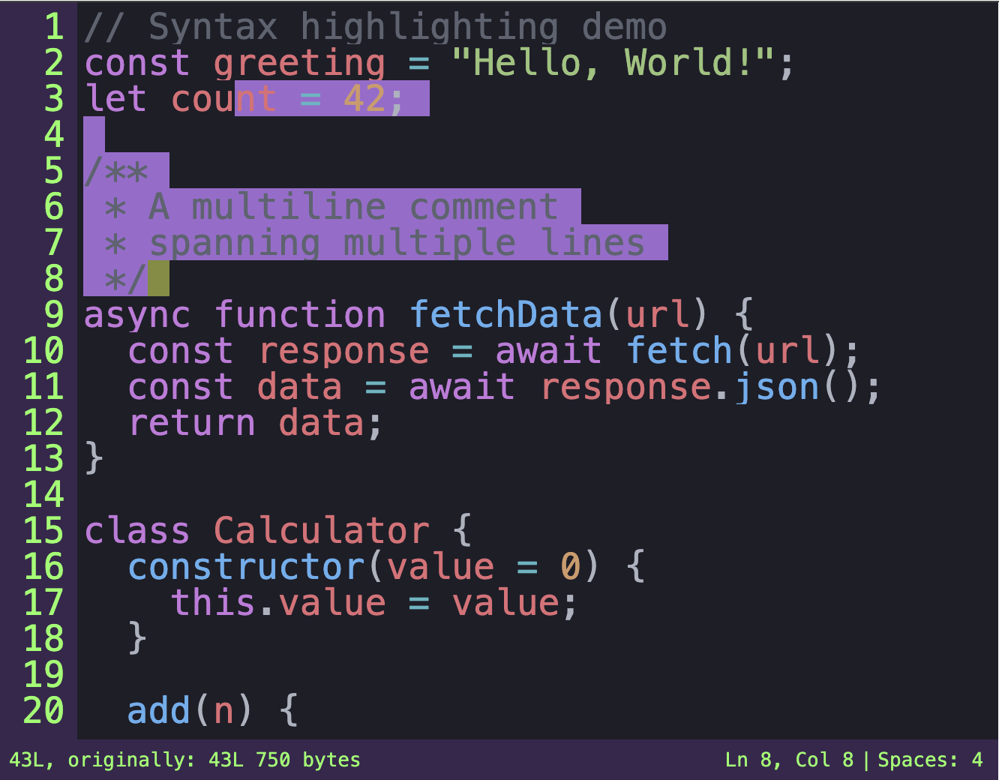

# Buffee


Inspired by the spartan performance and minimalism of terminal interfaces and Vim, Buffee is a
microlibrary and efficient plaintext rendering engine for the web. Fixed-width text in a grid layout is not a bug, it's a feature! Yes - like Emacs, this microlibrary includes a text editor too.

- tiny footprint: ~4kb, zero-dependency, low memory/CPU overhead
- performance: rivals native editors like Vim - no slowdown on large files
- heavy-duty: ~70m+ SLOC files, (1B+ in ultra-high-capacity mode)
- minimal: no build step, no NPM, Just vendor the VanillaJS function. minimal surface area.
- extensible: TUI, syntax highlighting modules, hackable API/internals



[Live Demo](https://varrockbank.github.io/buffee/)

[Unit Tests](https://varrockbank.github.io/buffee/test/)

## An Embeddable Building Block

1. spartan (minimal, performant, capable)
2. hackable
3. tiny 

This trifecta uniquely positions buffee as a building block for rich editing experience, IDEs and apps. In fact, this guides what features to scope and omit.

See [comparison](https://varrockbank.github.io/buffee/comparison.html) and [performance](https://varrockbank.github.io/buffee/performance.html) for more on Buffee's niche.

## The Magic Trick

Key insights and performance levers are (1) small DOM footprint and (2) surgical DOM updates against viewport-restricted rendering. 

The zeitgeist of webdev is VDOM. This abstraction is not free at runtime. VDOM libraries are bulkier than Buffee in its entirety. Buffee gets away by dealing with 
a constrained UI surface space and not need diffs of arbitrary trees.

The fixed-width grid layout limitation help reduce complexity. 

Finally, V8 arrays, not being real arrays, prove miraculuously viable as a buffer data structure. VScode's Piecetree datastructure along is 10x the size of Buffee's entire source.

## Usage

### Font Requirements

Buffee assumes monospace fonts with accurate CSS `ch` values. If this assumption breaks, cursor 
will be visually misaligned from true position. This is more evident with variable-width 
text but some monospace fonts can cause "drift", fractions of a pixel per character, and 
these numeric errors accumulating.

- **Good:** Menlo, Consolas, `monospace` (generic)
- **Bad:** Monaco

To test: type "A" 100+ times and move cursor to end. If misaligned, try a different font.

### CSS 

[style.css](style.css) contains structural styles. Bring-your-own cursor and selection color.

```css
.wb { background-color: #282C34; color: #B2B2B2 }
.wb .wb-selection { background-color: #EDAD10 }
.wb .wb-cursor { background-color: #FF6B6B }
.wb .wb-gutter, .wb .wb-status { background-color: #21252B; color: #636D83 }
```

see [themes](https://varrockbank.github.io/buffee/themes.html) for inspiration.

### HTML

Editor instances bind to DOM node with this structure:

```html
<blockquote class="wb no-select" tabindex="0" id="editor">
  <textarea class="wb-clipboard-bridge" aria-hidden="true"></textarea>
  <div class="wb-content">
    <div class="wb-gutter"></div>
    <div class="wb-lines">
      <div class="wb-layer-text"></div>
      <div class="wb-layer-elements"></div>
      <div class="wb-cursor"></div>
    </div>
  </div>
  <div class="wb-status">
    <div class="wb-status-left">
      <span class="wb-linecount"></span>
    </div>
    <div class="wb-status-right">
      Ln <span class="wb-head-row"></span>, Col <span class="wb-head-col"></span>|
      <span class="wb-indentation"></span>
    </div>
  </div>
</blockquote>
```

### JavaScript

```javascript
const editor = new Buffee(document.getElementById("editor"), {});
```

Editor auto-fits to its container size. For fixed dimensions:

```javascript
new Buffee(el, { viewportRows: 20 });      // Fixed row count
new Buffee(el, { viewportCols: 80 });      // Fixed column width
new Buffee(el, { viewportRows: 20, viewportCols: 80 }); // Both fixed
```

Container should have explicit height inherit some percentage from parent. 

### Model-view-controller API

**Model** `instance.Model.lines` is the text buffer

**View** `instance.Viewport` subset of indices of text buffer to be rendered

**Controller** `instance.Selection` text editor operations are relative to the text Selection. Cursor are just a special case of Selection. Historically, indexing was Viewport relative but now absolute.

See: [API notes](https://varrockbank.github.io/buffee/API.html)

## Extensibility

Historically, extensibility was only via the MVC APIs. However, extensions can access deeper internals. See extensions directory for examples including:

- Tree-sitter (experimental)
- Regex based syntax highlighting
- TUI (legacy that fiddles with)
- Elementals (TUI 2.0 that uses layer API)

iOS support is currently provided as an extension which maps iOS events to keyboard events. see: index.html for example.

See: [Extensions](https://varrockbank.github.io/buffee/extensions.html)

## Versioning 

style.css and buffer.js share a version sequence. 

if buffer.js changes, its version need to be bumped up, past the version of style.css.

if style.css changes, its version needs to be bumped past buffer.js. 